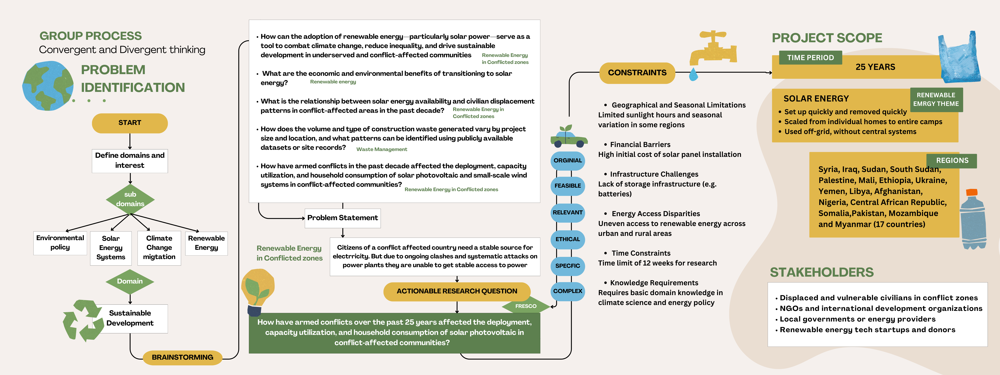

# Team Progress

## Convergent and Divergent thinking

### Problem Identification

```mermaid
---
config:
  theme: neutral
  look: neo
---
flowchart TB
 subgraph s1[" "]
        B{"Sub-domains"}
        A("Define Domain and Interests")
        BA("Environmental policy")
        BB("Solar Energy Systems")
        BC("Climate change mitigation")
        BD("Renewable Energy")
        C{"Domain"}
        D["Sustainable development"]
        nn("Start")
  end
 subgraph s[" "]
        n1["Problem Statement"]
        n2["Research questions"]
        n3["**How can the adoption of renewable
        energy—particularly solar power—serve as
        a tool to combat climate change, reduce inequality,
        and drive sustainable development in under-served and conflict-affected communities?**"]
        n31["**What are the economic and environmental benefits of transitioning
to solar energy?**"]
        n32["
        **How can small-scale solar energy users in unregulated markets
        Verify product quality through digital tools or cooperative purchasing models?**"]
        n33["**What is the relationship between solar
        energy availability and civilian displacement
        patterns in conflict-affected areas in the past decade?**"]
        n34["**How does the volume and type of
        construction waste generated vary by project
        size and location, and what patterns can be
        identified using publicly available datasets or site records?**"]
        n35["**How have armed conflicts in the past
        decade affected the deployment, capacity
        utilization, and household consumption of
        solar photovoltaic and small‐scale wind systems
        in conflict‐affected communities?**"]
        n36["**How can small-scale solar energy
        users in unregulated markets verify product
        quality through  digital tools or cooperative purchasing models?**"]
        n4(["Actionable Research Question"])
        n5["**How have armed conflicts in the past
        decade affected the deployment, capacity utilization,
        and household consumption of solar photovoltaic and
        small‐scale wind systems in conflict‐affected communities?**"]
  end
    A --> B
    B --> BA & BB & BC & BD
    BA ~~~ C
    BB ~~~ C
    BC ~~~ C
    BD ~~~ C
    nn --> A
    C --> D
    D --> n1
    n1 --> n2
    n2 --> n3 & n31 & n32 & n33 & n34 & n35 & n36
    n3 & n31 & n32 & n33 & n34 & n35 & n36 --> n4
    n4 --> n5
    style B fill:#C8E6C9
    style A fill:#FFF9C4
    style C fill:#C8E6C9
    style n3 color:#000000
    style n4 fill:#FFF9C4

```

## Our Actionable Research Question

> _How have armed conflicts over the past 25 years
affected the deployment, capacity utilization,
and household consumption of solar photovoltaic systems in conflict‐affected communities?_

## Constraints

- Geographical and Seasonal Limitations
  - Limited sunlight hours and seasonal variation in some regions
- Financial Barriers
  - High initial cost of solar panel installation
- Infrastructure Challenges
  - Lack of storage infrastructure (e.g. batteries)
- Energy Access Disparities
  - Uneven access to renewable energy across urban and rural areas
- Time Constraints
  - Time limit of 12 weeks for research
- Knowledge Requirements
  - Requires basic domain knowledge in climate science and energy policy

## Project Scope

- **Time Period:** 25 years
- **Renewable Energy Theme:** Solar Energy

  _Why Solar Energy?_

  - **Fast & Flexible:** Easy to deploy, remove, and scale
     — from single homes to entire camps.  
  - **Off-Grid Ready:** Operates independently of central
     power infrastructure.  
  - **Data-Rich:** Ample data on solar use and conflict
     impacts enables robust analysis.  
  - **High Impact:** Enhances resilience, reduces emissions,
     and improves daily life in conflict zones.

- **Regions:** Syria, Iraq, Sudan, South Sudan, Palestine, Mali, Ethiopia,
  Ukraine, Yemen, Libya, Afghanistan, Nigeria, Central African Republic,
  Somalia,Pakistan, Mozambique and Myanmar (17 countries)
