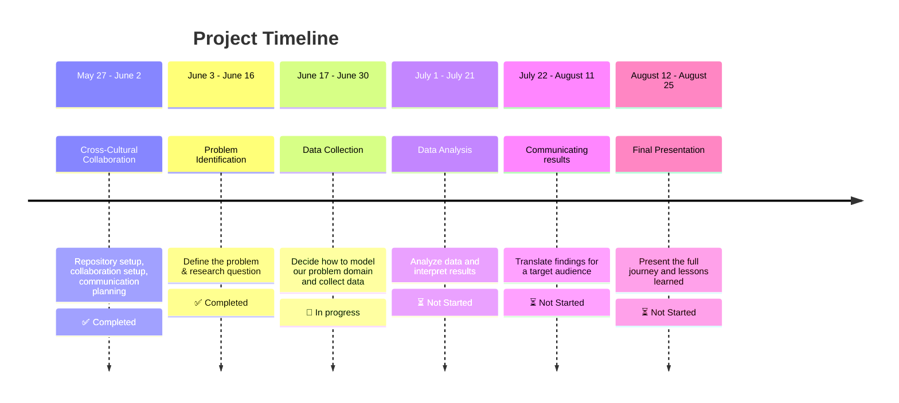

<!-- markdownlint-disable MD031 MD033 MD004 MD009 MD013 MD045 MD041 MD032 MD039 MD019 MD012-->

[](https://git.io/typing-svg)


**Welcome aboard the CDSP Group 08 Repository!**   🌌  
_Displaced. Determined. Data-Driven._

## M0: Project Overview

We are a team united by _purpose and shaped by displacement_, using data science
 to **drive real-world impact.**  
 
 This project applies data exploration, modeling,
 and visualization to explore how renewable energy, specifically solar energy (i.e. PV cells),
 serves as critical survival infrastructure in conflict-affected communities worldwide.


<!-- markdownlint-disable MD031 MD033 MD004 MD009 MD013 MD045 MD001 -->
## [Domain Research & Background](https://github.com/MIT-Emerging-Talent/ET6-CDSP-group-08-repo/blob/main/0_domain_study/README.md)

> Solar Energy acts as a vital **survival infrastructure** in conflict zones.

Citizens in conflict-affected countries require stable electricity sources,
yet ongoing clashes and targeted attacks on power infrastructure have
severely disrupted their access to reliable power.   
This project examines how solar photovoltaic systems function not as 
environmental solutions, but as **critical survival technology** that 
enables families to maintain essential services when all
other energy sources fail.

#### The Humanitarian Energy Crisis

Armed conflicts create immediate survival challenges that go 
far beyond traditional security concerns. As of 2024, over 130 million people
worldwide have been forcibly displaced by war, persecution, and disaster,
including 37.6 million refugees and 68.3 million internally displaced persons. 
While humanitarian responses typically prioritize food, shelter, and medical 
care, these essential services all depend on 
one critical resource: **reliable energy access**.

The energy reality for conflict-affected communities is stark. 
Nearly 90% of refugee settlements lack reliable electricity access,
forcing families to rely on dangerous and inadequate alternatives.
Over 80% of displaced populations still depend on firewood or biomass
for cooking, exposing women and girls to safety risks while contributing
to indoor air pollution that kills millions annually.
This energy poverty doesn't just limit comfort, it directly threatens
survival by compromising medical services, water access, communication
systems, and basic safety through adequate lighting.

#### Solar PV as Critical Survival Technology

In this context, solar photovoltaic systems have emerged not as environmental
solutions, **but as survival infrastructure**. Unlike centralized power grids
that become primary targets during conflicts, distributed solar systems
offer resilient, locally-controlled energy that can function
independently of broader infrastructure networks.

The deployment patterns reveal this survival imperative clearly.
Gaza provides the most compelling example: despite ongoing
conflict, the territory maintains an estimated 12,400 rooftop 
solar installations. This is likely the highest concentration 
globally relative to population size. These systems were 
not installed for environmental reasons but out of necessity,
as Gaza residents received grid power for only 6-8 hours 
daily even before the current crisis. Solar now accounts
for more than 50% of the territory's electricity production,
powering essential services from medical clinics to water pumping systems.

Similarly, in Afghanistan, solar deployment increased during 
conflict periods specifically because it was "the only
approach based on economics and reducing risks to personnel
in a war zone". Mobile clinics, field hospitals, and 
communication systems rely on solar power when traditional
energy infrastructure fails or becomes too dangerous to maintain.

### Research Gap & Critical Knowledge Needs

Despite growing recognition of solar energy's role
in conflict zones, significant knowledge gaps 
remain about how armed conflicts specifically
affect three critical dimensions of solar deployment:

1. **Deployment Patterns**: How do conflict dynamics influence where,
    when, and why households and communities install solar PV systems?
    Do installations increase during active conflict due to grid
    failures, or decrease due to economic constraints and physical dangers?

2. **Capacity Utilization**: How effectively do solar systems operate
    under conflict conditions? Evidence from Gaza shows that 64.8%
    of solar panels have been damaged by ongoing hostilities, yet families
    continue using compromised systems because they provide essential survival
    power.

3. **Household Consumption**: How do energy consumption patterns
    change when families transition from grid dependence
    to solar-powered systems during conflicts? What services do
    households prioritize when energy becomes scarce and self-generated?

## [M1: Research Question & Objectives](0_domain_study/progress.md)

### Actionable Research Question

> **How have armed conflicts over the past 15 years influenced the deployment,
> capacity utilization, and household consumption of solar photovoltaic
> systems—both environmentally and socially—in conflict-affected communities?**

#### Research Focus & Significance

By examining the relationships between conflict intensity,
solar system adoption rates, capacity factors, and 
household energy consumption patterns, we can better 
understand how families adapt their energy strategies 
for survival. The findings will inform humanitarian energy planning, 
post-conflict reconstruction efforts, and resilient 
infrastructure design for communities facing ongoing
security challenges.

**Why This Matters:**

- Solar energy offers fast, decentralized, and life-saving power in conflict-affected areas,
  where 733 million people still lack electricity. This technology empowers vulnerable
  communities by delivering resilience, dignity, and sustainable
  energy infrastructure during humanitarian crises.

- Solving this problem could provide life-saving infrastructure
 in unstable regions, promote energy equity, and support
 long-term sustainable development goals.

- The humanitarian community and affected populations
 increasingly recognize the need for resilient, sustainable,
 and decentralized energy solutions in conflicted areas.

### Project Scope

- **Time Period**: 15 years (2010-2024)
- **Renewable Energy Focus:** Solar Photovoltaic Systems 
- **Geographic Regions:** Syria, Iraq, Sudan, South Sudan, Palestine, Mali, Ethiopia, Ukraine, Yemen, Libya, Afghanistan, Nigeria, Central African Republic, Somalia,Pakistan, Mozambique and Myanmar (17 countries)
- **Analysis Dimensions:** Deployment patterns, capacity utilization, household consumption.

### [Methodology & System Approach](https://github.com/MIT-Emerging-Talent/ET6-CDSP-group-08-repo/blob/main/0_domain_study/understanding_of_problem_domain.md)

To ground our data‑driven work in real‑world context, we've prepared a detailed [systems analysis](https://github.com/MIT-Emerging-Talent/ET6-CDSP-group-08-repo/blob/main/0_domain_study/understanding_of_problem_domain.md) of the electrical power challenges in conflict‑affected areas:

* **Patterns & trends** in how and where outages occur. 
* **Underlying structures** that make the grid vulnerable. 
* **Mental models** shaping decision‑making on both sides.  
* **Potential interventions** from distributed solar microgrids to local maintenance committ

<!-- markdownlint-disable MD031 MD033 MD013 MD001 MD04 MD045 MD049 MD041 MD022 MD042 MD018-->

## [M2: Data Collection](https://github.com/MIT-Emerging-Talent/ET6-CDSP-group-08-repo/tree/main/1_datasets)

### [Domain Modeling](https://github.com/MIT-Emerging-Talent/ET6-CDSP-group-08-repo/blob/main/1_datasets/non_tech_exp_of_domain_modeling.md)

<!-- markdownlint-disable MD031 MD033 MD013 MD012 MD001 MD04 MD045 MD049 MD041-->
## Domain Modeling (non-technical explanation)

Imagine trying to understand how people survive in war-torn areas when the lights go out — literally. That’s where our project begins. We built something called a **domain model**, which is just a fancy way of saying: _"Let’s draw a simple map to make sense of a really messy situation."_

At the center of it all is **solar energy** — not just as a clean tech solution, but as a **lifeline** when everything else fails. When power lines are bombed, families are displaced, and normal life disappears, solar can step in as **survival infrastructure** — helping people charge phones, power lights, and keep hospitals or schools running. We're looking at things like:

<table>
  <tr>
    <td></td>
    <td></td>
  </tr>
</table>
<details><summary><b>To understand how this all works, we looked at three big clues (datasets): </b></summary>


- **On-Grid and Off-Grid Data** _tells us how traditional electricity drops off during conflict. It’s like tracking where the lights go out and shows how people start using solar systems when the grid fails — kind of like switching from the main power to a backup generator._
- **Renewable and Non-Renewables** _helps us compare how energy use shifts in crisis: are countries using more solar or still relying on fossil fuels_
- **UN Comtrade Data** _tracks the flow of solar equipment (like panels and batteries) into countries over time, revealing how conflict affects supply chains and access to solar tech._
</details>

<details><summary><b>Our domain model focuses on three main areas: </b></summary>
 
<table>
  <tr>
    <td style="vertical-align: top; width: 70%;">
      <ul>
        <li><strong>"Survival Infrastructure"</strong>: We're looking at <em>solar PV</em> as a <em>fundamental tool for human survival</em> - not just another <em>green tech solution</em>.</li>
        <li><strong>Conflict Lifecycle</strong>: We break down solar's role across the <em>pre-conflict, active conflict, and post-conflict phases</em> – because its utility changes drastically through each.</li>
        <li><strong>Three Pillars of Impact</strong>: To get measurable, we're zeroing in on <strong>Deployment Patterns, Capacity Utilization, and Household Consumption</strong>. These are our core measurable areas, directly feeding into our main research question.</li>
      </ul>
    </td>
    <td style="vertical-align: top; width: 30%;">
      
    </td>
  </tr>
</table>
</details>


### [Data Sets](https://github.com/MIT-Emerging-Talent/ET6-CDSP-group-08-repo/blob/main/1_datasets/README.md)

1. **[Raw: Off-grid Renewable Energy Statistics 2024](https://github.com/MIT-Emerging-Talent/ET6-CDSP-group-08-repo/blob/main/1_datasets/raw_data/IRENA_OFGStats.raw.xlsx)** to _[Cleaned: Off-grid](https://github.com/MIT-Emerging-Talent/ET6-CDSP-group-08-repo/blob/main/2_data_preparation/IRENA_OFG_cleaned.ipynb)_
2. **[Raw: On-grid Renewable Energy Statistics 2024](https://github.com/MIT-Emerging-Talent/ET6-CDSP-group-08-repo/blob/main/1_datasets/raw_data/IRENA_Stats_extract_2025_H1_raw.xlsx)** to _[Cleaned: On-grid](https://github.com/MIT-Emerging-Talent/ET6-CDSP-group-08-repo/blob/main/2_data_preparation/IRENA_ONG_cleaned.ipynb)_
3. **[Raw: UN Comtrade data](https://github.com/MIT-Emerging-Talent/ET6-CDSP-group-08-repo/blob/main/1_datasets/raw_data/UN_Comtrade_imports_dataset_raw.xlsx)** to _[Cleaned: UN Comtrade](https://github.com/MIT-Emerging-Talent/ET6-CDSP-group-08-repo/blob/main/2_data_preparation/UN_comtrade_data_cleaning.ipynb)_

For more details refer to [/2_data_preparation](https://github.com/MIT-Emerging-Talent/ET6-CDSP-group-08-repo/tree/main/2_data_preparation) keeping all our cleaning, transformation, and prep scripts and [/3_data_exploration](https://github.com/MIT-Emerging-Talent/ET6-CDSP-group-08-repo/tree/main/3_data_exploration) exploring, visualizing, and get a feel for our datasets. 


## [M3: Data Analysis]()


---

---

## Repository structure

```text
project/
├── README.md                   # Project overview and main instructions
├── guide.md                    # Detailed guide on using this template
├── /collaboration/             # Team norms, strategies, and retrospectives
├── /notes/                     # Shared resources and learning materials
├── /0_domain_study/            # Domain research and background
├── /1_datasets/                # Raw and processed datasets
├── /2_data_preparation/        # Scripts for cleaning and processing data
├── /3_data_exploration/        # Scripts for initial data understanding
├── /4_data_analysis/           # Scripts for in-depth analysis
├── /5_communication_strategy/  # Materials for communicating findings
└── /6_final_presentation/      # Final presentation materials

```

## Team Members


_Who's behind all this? Meet the passionate minds Github driving this project:_

- **ِ[Abdallah Alnajjar](https://github.com/theabdallahnjr)**
- **[Ahd Basan](https://github.com/ahdbasan)**
- **[Anyak](https://github.com/Anyak7)**
- **[Mariia Ermishina](https://github.com/ermishina)**
- **[Mohamed Altayeb](https://github.com/Mo-Altayeb)**
- **[Mohamed Saeed👨‍💻](https://github.com/Tbaosman)**
- **[Mohamed Elnajeeb](https://github.com/Mohamed-Elnageeb)**
- **[Muhannad Assaf](https://github.com/MuhannadGTR)**
- **[Eman Alfalouji](https://github.com/Emanfalouji)**
- **[Zeinab Mohammed](https://github.com/Zeinab15)**
- **[Maria Alejandra Cardeno](https://github.com/mariacommits)**

## [Contributing](https://github.com/MIT-Emerging-Talent/ET6-CDSP-group-08-repo/blob/main/CONTRIBUTING.md)

 To set up the project locally and understand our contribution guidelines, please see our [CONTRIBUTING.md](https://github.com/MIT-Emerging-Talent/ET6-CDSP-group-08-repo/blob/main/CONTRIBUTING.md) file.

##  [Notes](https://github.com/MIT-Emerging-Talent/ET6-CDSP-group-08-repo/tree/main/notes)

This is a work in progress. More updates and details will be added soon to
this readme. Stay tuned!

## [License](https://github.com/MIT-Emerging-Talent/ET6-CDSP-group-08-repo/blob/main/LICENSE)

This project is licensed under the MIT License -
see the [LICENSE](https://github.com/MIT-Emerging-Talent/ET6-CDSP-group-08-repo/blob/main/LICENSE) file for details.
