```mermaid
timeline
    title Project Timeline
    section May 27 - June 2
        Cross-Cultural Collaboration :
            Repository setup, collaboration setup, communication planning : ✅ Completed
    section June 3 - June 16
        Problem Identification :
            Define the problem & research question : ✅ Completed
    section June 17 - June 30
        Data Collection :
            Decide how to model our problem domain and collect data : ✅ Completed
    section July 1 - July 21
        Data Analysis:
            Analyze data and interpret results : 🔄 In progress
    section July 22 - August 11
        Communicating results:
            Translate findings for a target audience : ⏳ Not Started
    section August 12 - August 25
        Final Presentation:
            Present the full journey and lessons learned : ⏳ Not Started
```

<!-- markdownlint-disable MD031 MD033 MD004 MD009 MD013 MD045 MD041 MD032 MD039 MD019 MD012-->


<!-- markdownlint-disable MD031 MD033 MD004 MD009 MD013 MD045 MD001 -->
[](https://git.io/typing-svg)


**Welcome aboard the CDSP Group 08 Repository!**   🌌  
_Displaced. Determined. Data-Driven._

## M0: Project Overview

We are a team united by _purpose and shaped by displacement_, using data science
 to **drive real-world impact.** This project applies data exploration, modeling,
 and visualization to explore how renewable energy, specifically **solar energy** (i.e. PV cells),
 serves as _critical survival infrastructure in conflict-affected communities_ worldwide.

## [Domain Research & Background](https://github.com/MIT-Emerging-Talent/ET6-CDSP-group-08-repo/blob/main/0_domain_study/README.md)

> [Solar Energy acts as a vital **survival infrastructure** in conflict zones.](https://www.pv-tech.org/how-solar-can-bring-light-to-war-zones/)

Citizens in conflict-affected countries require stable electricity sources,
yet ongoing clashes and targeted attacks on power infrastructure have
severely disrupted their access to reliable power.   
This project examines how solar photovoltaic systems function [not as 
environmental solutions](https://www.csis.org/analysis/gazas-solar-power-wartime), but as **critical survival technology** that 
enables families to maintain essential services when all
other energy sources fail.

#### The Humanitarian Energy Crisis

Armed conflicts create immediate survival challenges that go 
far beyond traditional security concerns. As of 2024, over [130 million people](https://www.unhcr.org/global-trends)
worldwide have been forcibly displaced by war, persecution, and disaster,
including 37.6 million refugees and 68.3 million internally displaced persons. 
While humanitarian responses typically prioritize food, shelter, and medical 
care, these essential services all depend on 
one critical resource: **reliable energy access**.

The energy reality for conflict-affected communities is stark. 
Nearly [90%](https://unepccc.org/project/sustainable-energy-use-in-refugee-camps/) of refugee settlements lack reliable electricity access,
forcing families to rely on dangerous and inadequate alternatives.
Over [80%](https://energypedia.info/wiki/Energy_Access_in_Displacement_Settings) of displaced populations still depend on firewood or biomass
for cooking, exposing women and girls to safety risks while contributing
to indoor air pollution that kills millions annually.
This energy poverty doesn't just [limit comfort](https://www.unhcr.org/in/sites/en-in/files/legacy-pdf/4a1d2f422.pdf), it directly threatens
survival by compromising medical services, water access, communication
systems, and basic safety through adequate lighting.

#### Solar PV as Critical Survival Technology

In this context, solar photovoltaic systems have emerged not as environmental
solutions, **but as survival infrastructure**. Unlike centralized power grids
that become primary targets during conflicts, distributed solar systems
offer resilient, locally-controlled energy that can function
independently of broader infrastructure networks.

The deployment patterns reveal this survival imperative clearly.
Gaza provides the most compelling example: despite ongoing
conflict, the territory maintains an estimated [12,400 rooftop 
solar installations](https://www.csis.org/analysis/gazas-solar-power-wartime). This is likely the highest concentration 
globally relative to population size. These systems were 
not installed for environmental reasons but out of necessity,
as Gaza residents received grid power for only 6-8 hours 
daily even before the current crisis. Solar now accounts
for more than 50% of the territory's electricity production,
powering essential services from medical clinics to water pumping systems.

Similarly, in Afghanistan, solar deployment increased during 
conflict periods specifically because it was "the only
approach based on [economics and reducing risks](https://ases.org/wp-content/uploads/2021/11/Hybrid-Solar-Power-in-Afghanistan-War-Zone-%E2%80%93-Unique-Engineering-and-Economic-Factors-.pdf) to personnel
in a war zone". Mobile clinics, field hospitals, and 
communication systems rely on solar power when traditional
energy infrastructure fails or becomes too dangerous to maintain.

### Research Gap & Critical Knowledge Needs

Despite growing recognition of solar energy's role
in conflict zones, significant knowledge gaps 
remain about how armed conflicts specifically
affect three critical dimensions of solar deployment:

1. <details><summary><b>Deployment Patterns</b></summary><p>How do conflict dynamics influence where,
    when, and why households and communities install solar PV systems?
    Do installations increase during active conflict due to grid
    failures, or decrease due to economic constraints and physical dangers?</p></details>

2. <details><summary><b>Capacity Utilization</b></summary><p>How effectively do solar systems operate
    under conflict conditions? Evidence from Gaza shows that 64.8%
    of solar panels have been damaged by ongoing hostilities, yet families
    continue using compromised systems because they provide essential survival
    power.</p></details>

3. <details><summary><b>Household Consumption</b></summary><p>How do energy consumption patterns
    change when families transition from grid dependence
    to solar-powered systems during conflicts? What services do
    households prioritize when energy becomes scarce and self-generated?</p></details>
---

## [M1: Research Question & Objectives](0_domain_study/progress.md)

### Research Question

> **How have armed conflicts over the past 25 years influenced the deployment,
> capacity utilization, and household consumption of solar photovoltaic
> systems—both environmentally and socially—in conflict-affected communities?**

#### Research Focus & Significance

By examining the relationships between conflict intensity,
solar system adoption rates, capacity factors, and 
household energy consumption patterns, we can better 
understand how families adapt their energy strategies 
for survival. The findings will inform humanitarian energy planning, 
post-conflict reconstruction efforts, and resilient 
infrastructure design for communities facing ongoing
security challenges.

<details><summary><b>Why This Matters?</b></summary>

- Solar energy offers fast, decentralized, and life-saving power in conflict-affected areas,
  where [675 million](https://www.worldbank.org/en/topic/energy/overview) people still lack electricity. This technology empowers vulnerable
  communities by delivering resilience, dignity, and sustainable
  energy infrastructure during [humanitarian crises.](https://solgenpower.com/2023/10/10/the-benefits-of-solar-energy-for-humanitarian-aid/)

- Solving this problem could provide life-saving infrastructure
 in unstable regions, promote energy equity, and support
 long-term [sustainable development goals.](https://www.hhs.se/sv/om-oss/news/news-from-misum/2016/sdgs-in-conflict/)

- The humanitarian community and affected populations
 increasingly recognize the need for resilient [sustainable
 and decentralized energy solutions in conflicted areas](https://www.cyis.org/post/renewable-energy-in-conflict-zones-protecting-war-torn-environments)</details>

### Project Scope

- **Time Period**: 25 years (2000-2024)
- **Renewable Energy Focus:** Solar Photovoltaic Systems 
- **Geographic Regions:** Syria, Iraq, Sudan, South Sudan, Palestine, Mali, Ethiopia, Ukraine, Yemen, Libya, Afghanistan, Nigeria, Central African Republic, Somalia,Pakistan, Mozambique and Myanmar (17 countries)
- **Analysis Dimensions:** Deployment patterns, capacity utilization, household consumption.

### Methodology & System Approach

To ground our data‑driven work in real‑world context, we've prepared a detailed [systems analysis](https://github.com/MIT-Emerging-Talent/ET6-CDSP-group-08-repo/blob/main/0_domain_study/understanding_of_problem_domain.md) of the electrical power challenges in conflict‑affected areas:

* **Patterns & trends** in how and where outages occur. 
* **Underlying structures** that make the grid vulnerable. 
* **Mental models** shaping decision‑making on both sides.  
* **Potential interventions** from distributed solar microgrids to local maintenance committ

<!-- markdownlint-disable MD031 MD033 MD013 MD001 MD04 MD045 MD049 MD041 MD022 MD042 MD018-->
---
## [M2: Data Collection](https://github.com/MIT-Emerging-Talent/ET6-CDSP-group-08-repo/tree/main/1_datasets)

### [Domain Modeling](https://github.com/MIT-Emerging-Talent/ET6-CDSP-group-08-repo/blob/main/1_datasets/non_tech_exp_of_domain_modeling.md)

Imagine trying to understand how people survive in war-torn areas when the lights go out — literally. That’s where our project begins. We built something called a **domain model**, which is just a fancy way of saying: _"Let’s draw a simple map to make sense of a really messy situation."_

At the center of it all is **solar energy** — not just as a clean tech solution, but as a **lifeline** when everything else fails. When power lines are bombed, families are displaced, and normal life disappears, solar can step in as **survival infrastructure** — helping people charge phones, power lights, and keep hospitals or schools running. We're looking at things like:

<table>
  <tr>
    <td></td>
    <td></td>
  </tr>
</table>
<details><summary><b>To understand how this all works, we looked at three big clues (datasets): </b></summary>


- **On-Grid and Off-Grid Data** _tells us how traditional electricity drops off during conflict. It’s like tracking where the lights go out and shows how people start using solar systems when the grid fails — kind of like switching from the main power to a backup generator._
- **Renewable and Non-Renewables** _helps us compare how energy use shifts in crisis: are countries using more solar or still relying on fossil fuels_
- **UN Comtrade Data** _tracks the flow of solar equipment (like panels and batteries) into countries over time, revealing how conflict affects supply chains and access to solar tech._
</details>

<details><summary><b>Our domain model focuses on three main areas: </b></summary>
 
<table>
  <tr>
    <td style="vertical-align: top; width: 70%;">
      <ul>
        <li><strong>"Survival Infrastructure"</strong>: We're looking at <em>solar PV</em> as a <em>fundamental tool for human survival</em> - not just another <em>green tech solution</em>.</li>
        <li><strong>Conflict Lifecycle</strong>: We break down solar's role across the <em>pre-conflict, active conflict, and post-conflict phases</em> – because its utility changes drastically through each.</li>
        <li><strong>Three Pillars of Impact</strong>: To get measurable, we're zeroing in on <strong>Deployment Patterns, Capacity Utilization, and Household Consumption</strong>. These are our core measurable areas, directly feeding into our main research question.</li>
      </ul>
    </td>
    <td style="vertical-align: top; width: 30%;">
      
    </td>
  </tr>
</table>
</details>

**How We Modeled the Research Question with Data?**  
We explored how conflict impacts the development and trade of solar energy by combining capacity, off-grid, and trade data with conflict classifications. Countries were categorized by conflict phase (pre-conflict, active-conflict, post-conflict), and we tracked solar adoption trends across these phases using time-series and geospatial analysis.

### [Data Sets](https://github.com/MIT-Emerging-Talent/ET6-CDSP-group-08-repo/blob/main/1_datasets/README.md)

A detailed description of each dataset, including collection methods, potential limitations, and direct relevance to our problem, can be found in the Datasets Used section.
1. **IRENA Renewable Energy Statistics:** Providing annual data on both off-grid and on-grid renewable energy capacity and generation worldwide.
    - **[Raw: Off-grid Renewable Energy Statistics 2024](https://github.com/MIT-Emerging-Talent/ET6-CDSP-group-08-repo/blob/main/1_datasets/raw_data/IRENA_OFGStats.raw.xlsx)** to _[Cleaned: Off-grid](https://github.com/MIT-Emerging-Talent/ET6-CDSP-group-08-repo/blob/main/2_data_preparation/IRENA_OFG_cleaned.ipynb)_  
 Tracks solar and renewable electricity generation across countries and years.
    - **[Raw: On-grid Renewable Energy Statistics 2024](https://github.com/MIT-Emerging-Talent/ET6-CDSP-group-08-repo/blob/main/1_datasets/raw_data/IRENA_Stats_extract_2025_H1_raw.xlsx)** to _[Cleaned: On-grid](https://github.com/MIT-Emerging-Talent/ET6-CDSP-group-08-repo/blob/main/2_data_preparation/IRENA_ONG_cleaned.ipynb)_  
Focuses on decentralized solar systems (e.g., mini-grids and solar home systems), crucial for conflict-affected areas.

2. **UN Comtrade:** Offering detailed trade data on solar-related products (e.g., panels, inverters), crucial for understanding import trends in conflict zones.
    - **[Raw: UN Comtrade data](https://github.com/MIT-Emerging-Talent/ET6-CDSP-group-08-repo/blob/main/1_datasets/raw_data/UN_Comtrade_imports_dataset_raw.xlsx)** to _[Cleaned: UN Comtrade](https://github.com/MIT-Emerging-Talent/ET6-CDSP-group-08-repo/blob/main/2_data_preparation/UN_comtrade_data_cleaning.ipynb)_  
Captures international trade in solar panels and related equipment.

<details>
<summary><strong>Data Preparation</strong></summary>
#### Data Preparation Process
 
- **Timeframe filtered:**  
  All datasets were limited to **2000–2024**.

- **Conflict labels added:**  
  Countries were tagged by their **conflict phase** (pre-, active-, post-conflict).

- **Cleaning steps included:**  
  - Removing irrelevant or non-solar data  
  - Handling missing values (e.g., mean imputation)  
  - Renaming columns for consistency  
  - Filtering for solar technologies only


</details>

<details>
<summary><strong>Data Exploration</strong></summary>

Initial data exploration, visualization, and descriptive statistics were performed on the cleaned datasets to understand their characteristics, distributions, and potential relationships. This process, fully documented within the `3_data_exploration/` directory, helped us:

- Gain foundational insights into _data quality_  
- Identify preliminary patterns  
- Guide subsequent analytical steps for addressing our research question

</details>

For more details refer to [/2_data_preparation](https://github.com/MIT-Emerging-Talent/ET6-CDSP-group-08-repo/tree/main/2_data_preparation) keeping all our cleaning, transformation, and prep scripts and [/3_data_exploration](https://github.com/MIT-Emerging-Talent/ET6-CDSP-group-08-repo/tree/main/3_data_exploration) exploring, visualizing, and get a feel for our datasets. 

---

## [M3: Data Analysis](https://github.com/MIT-Emerging-Talent/ET6-CDSP-group-08-repo/tree/main/4_data_analysis)

It investigates how solar energy deployment changes across different **phases of conflict, economic statuses, duration, technology types and both environmental and social impact** in different conflict-affected countries ( 2000–2024 ); using IRENA and UN Comtrade datasets, analyzing on-grid/off-grid capacity, import trends, and conflict timelines.


<details>
<summary><strong>Analytical Questions</strong></summary>

> [**Q1.  What are the trends in solar energy adoption across the full conflict cycle—pre-conflict, active conflict, and post-conflict periods—in conflict-affected countries?**](https://github.com/MIT-Emerging-Talent/ET6-CDSP-group-08-repo/tree/main/4_data_analysis/phases_analysis)  
>
> [**Q2.  To what extent are these datasets comparable, and what differences, if any, exist in what they measure?**](https://github.com/MIT-Emerging-Talent/ET6-CDSP-group-08-repo/tree/main/4_data_analysis/data_comparison_analysis)
>
> [**Q3.  What is the effect of conflict duration (continuous vs. periodical or no conflict) on the adoption of solar energy technologies?**](https://github.com/MIT-Emerging-Talent/ET6-CDSP-group-08-repo/tree/main/4_data_analysis/duration_analysis)
>
> **Q4.  What are the environmental and social impact in conflict-affected countries?**
</details>

### Key Insights
Conflict periods are often associated with increased solar energy adoption — but this relationship is **indicative, not causal**. 

- Conflict does not automatically suppress development — **windows of opportunity** can exist even in fragile settings.
- **Recovery capacity** varies widely; some countries rebound with aid or reform, others remain paralyzed.
- Strategic, resilient infrastructure development is possible — but often hinges on **timing, governance, and stability**.

### Key Conclusions

- **Solar capacity grows during conflict**, especially in lower-income countries.
- **Off-grid systems** surge in fragile settings, likely due to humanitarian support.
- **Solar imports correlate** with deployment in some contexts (e.g., Ethiopia), but **not reliably**.

### Confidence Level

We are **moderately confident** in the trends observed. Core patterns appear consistent across countries, but some data gaps and contextual complexities limit certainty.

### Limitations

- Data gaps in post-conflict years and low-income countries.
- Imports ≠ direct deployment; stockpiling or re-exports possible.
- No modeling of lag effects between import and deployment.
- Conflict phase definitions are simplified proxies.

[Full list of assumptions and limitations](..\4_data_analysis\README.md)

### Future Work

- Use maps or data showing how intense conflict is in different areas.
- Study if there's a delay between importing equipment and solar growth.
- Compare solar projects funded by aid vs. those driven by local markets.
- Check the results against real project data or insights from local experts.

For more details refer to [/4_data_analysis](https://github.com/MIT-Emerging-Talent/ET6-CDSP-group-08-repo/tree/main/4_data_analysis) including all scripts, visualizations, technical methodology, and a non-technical summary of our findings, confidence levels, and limitations. 


---

---

## Repository structure

```text
project/
├── README.md                   # Project overview and main instructions
├── guide.md                    # Detailed guide on using this template
├── /collaboration/             # Team norms, strategies, and retrospectives
├── /notes/                     # Shared resources and learning materials
├── /0_domain_study/            # Domain research and background
├── /1_datasets/                # Raw and processed datasets
├── /2_data_preparation/        # Scripts for cleaning and processing data
├── /3_data_exploration/        # Scripts for initial data understanding
├── /4_data_analysis/           # Scripts for in-depth analysis
├── /5_communication_strategy/  # Materials for communicating findings
└── /6_final_presentation/      # Final presentation materials

```

## Team Members


_Who's behind all this? Meet the passionate minds Github driving this project:_

- **ِ[Abdallah Alnajjar](https://github.com/theabdallahnjr)**
- **[Ahd Basan](https://github.com/ahdbasan)**
- **[Anyak](https://github.com/Anyak7)**
- **[Mariia Ermishina](https://github.com/ermishina)**
- **[Mohamed Altayeb](https://github.com/Mo-Altayeb)**
- **[Mohamed Saeed👨‍💻](https://github.com/Tbaosman)**
- **[Mohamed Elnajeeb](https://github.com/Mohamed-Elnageeb)**
- **[Muhannad Assaf](https://github.com/MuhannadGTR)**
- **[Eman Alfalouji](https://github.com/Emanfalouji)**
- **[Zeinab Mohammed](https://github.com/Zeinab15)**
- **[Maria Alejandra Cardeno](https://github.com/mariacommits)**

## [Contributing](https://github.com/MIT-Emerging-Talent/ET6-CDSP-group-08-repo/blob/main/CONTRIBUTING.md)

 To set up the project locally and understand our contribution guidelines, please see our [CONTRIBUTING.md](https://github.com/MIT-Emerging-Talent/ET6-CDSP-group-08-repo/blob/main/CONTRIBUTING.md) file.

##  [Notes](https://github.com/MIT-Emerging-Talent/ET6-CDSP-group-08-repo/tree/main/notes)

This is a work in progress. More updates and details will be added soon to
this readme. Stay tuned!

## [License](https://github.com/MIT-Emerging-Talent/ET6-CDSP-group-08-repo/blob/main/LICENSE)

This project is licensed under the MIT License -
see the [LICENSE](https://github.com/MIT-Emerging-Talent/ET6-CDSP-group-08-repo/blob/main/LICENSE) file for details.
