```mermaid
timeline
    title Project Timeline
    section May 27 - June 2
        Cross-Cultural Collaboration :
            Repository setup, collaboration setup, communication planning : ✅ Completed
    section June 3 - June 16
        Problem Identification :
            Define the problem & research question : ✅ Completed
    section June 17 - June 30
        Data Collection :
            Decide how to model our problem domain and collect data : ✅ Completed
    section July 1 - July 21
        Data Analysis:
            Analyze data and interpret results : ✅ Completed
    section July 22 - August 11
        Communicating results:
            Translate findings for a target audience : 🔄 In progress
    section August 12 - August 25
        Final Presentation:
            Present the full journey and lessons learned : ⏳ Not Started
```

<!-- markdownlint-disable MD013 MD031 MD007 MD033 MD004 MD009 MD013 MD045 MD041 MD032 MD039 MD019 MD012-->


<!-- markdownlint-disable MD031 MD033 MD004 MD001 MD009 MD013 MD045 MD001 -->
[](https://git.io/typing-svg)


**Welcome aboard the CDSP Group 08 Repository!**   🌌  
_Displaced. Determined. Data-Driven._

## M0: Project Overview

We are a team united by _purpose and shaped by displacement_, using data science
 to **drive real-world impact.** This project applies data exploration, modeling,
 and visualization to explore how renewable energy, specifically **solar energy** (i.e. PV cells),
 serves as _critical survival infrastructure in conflict-affected communities_ worldwide.

## [M1: Domain Research & Background](https://github.com/MIT-Emerging-Talent/ET6-CDSP-group-08-repo/blob/main/0_domain_study/README.md)

> [Solar Energy acts as a vital **survival infrastructure** in conflict zones.](https://www.pv-tech.org/how-solar-can-bring-light-to-war-zones/)

Citizens in conflict-affected countries require stable electricity sources,
yet ongoing clashes and targeted attacks on power infrastructure have
severely disrupted their access to reliable power.   
This project examines how solar photovoltaic systems function [not as 
environmental solutions](https://www.csis.org/analysis/gazas-solar-power-wartime), but as **critical survival technology** that 
enables families to maintain essential services when all
other energy sources fail.

#### The Humanitarian Energy Crisis

Armed conflicts create immediate survival challenges that go 
far beyond traditional security concerns. As of 2024, over [130 million people](https://www.unhcr.org/global-trends)
worldwide have been forcibly displaced by war, persecution, and disaster,
including 37.6 million refugees and 68.3 million internally displaced persons. 
While humanitarian responses typically prioritize food, shelter, and medical 
care, these essential services all depend on 
one critical resource: **reliable energy access**.

The energy reality for conflict-affected communities is stark. 
Nearly [90%](https://unepccc.org/project/sustainable-energy-use-in-refugee-camps/) of refugee settlements lack reliable electricity access,
forcing families to rely on dangerous and inadequate alternatives.
Over [80%](https://energypedia.info/wiki/Energy_Access_in_Displacement_Settings) of displaced populations still depend on firewood or biomass
for cooking, exposing women and girls to safety risks while contributing
to indoor air pollution that kills millions annually.
This energy poverty doesn't just [limit comfort](https://www.unhcr.org/in/sites/en-in/files/legacy-pdf/4a1d2f422.pdf), it directly threatens
survival by compromising medical services, water access, communication
systems, and basic safety through adequate lighting.

#### Solar PV as Critical Survival Technology

In this context, solar photovoltaic systems have emerged not as environmental
solutions, **but as survival infrastructure**. Unlike centralized power grids
that become primary targets during conflicts, distributed solar systems
offer resilient, locally-controlled energy that can function
independently of broader infrastructure networks.

The deployment patterns reveal this survival imperative clearly.
Gaza provides the most compelling example: despite ongoing
conflict, the territory maintains an estimated [12,400 rooftop 
solar installations](https://www.csis.org/analysis/gazas-solar-power-wartime). This is likely the highest concentration 
globally relative to population size. These systems were 
not installed for environmental reasons but out of necessity,
as Gaza residents received grid power for only 6-8 hours 
daily even before the current crisis. Solar now accounts
for more than 50% of the territory's electricity production,
powering essential services from medical clinics to water pumping systems.

Similarly, in Afghanistan, solar deployment increased during 
conflict periods specifically because it was "the only
approach based on [economics and reducing risks](https://ases.org/wp-content/uploads/2021/11/Hybrid-Solar-Power-in-Afghanistan-War-Zone-%E2%80%93-Unique-Engineering-and-Economic-Factors-.pdf) to personnel
in a war zone". Mobile clinics, field hospitals, and 
communication systems rely on solar power when traditional
energy infrastructure fails or becomes too dangerous to maintain.

### Research Gap & Critical Knowledge Needs

Despite growing recognition of solar energy's role
in conflict zones, significant knowledge gaps 
remain about how armed conflicts specifically
affect three critical dimensions of solar deployment:

1. <details><summary><b>Deployment Patterns</b></summary><p>How do conflict dynamics influence where,
    when, and why households and communities install solar PV systems?
    Do installations increase during active conflict due to grid
    failures, or decrease due to economic constraints and physical dangers?</p></details>

2. <details><summary><b>Capacity Utilization</b></summary><p>How effectively do solar systems operate
    under conflict conditions? Evidence from Gaza shows that 64.8%
    of solar panels have been damaged by ongoing hostilities, yet families
    continue using compromised systems because they provide essential survival
    power.</p></details>

3. <details><summary><b>Household Consumption</b></summary><p>How do energy consumption patterns
    change when families transition from grid dependence
    to solar-powered systems during conflicts? What services do
    households prioritize when energy becomes scarce and self-generated?</p></details>
---

## [Research Question & Objectives](0_domain_study/progress.md)

### Research Question

> **How have armed conflicts over the past 25 years influenced the deployment,
> capacity utilization, and household consumption of solar photovoltaic
> systems—both environmentally and socially—in conflict-affected communities?**

#### Research Focus & Significance

By examining the relationships between conflict intensity,
solar system adoption rates, capacity factors, and 
household energy consumption patterns, we can better 
understand how families adapt their energy strategies 
for survival. The findings will inform humanitarian energy planning, 
post-conflict reconstruction efforts, and resilient 
infrastructure design for communities facing ongoing
security challenges.

<details><summary><b>Why This Matters?</b></summary>

- Solar energy offers fast, decentralized, and life-saving power in conflict-affected areas,
  where [675 million](https://www.worldbank.org/en/topic/energy/overview) people still lack electricity. This technology empowers vulnerable
  communities by delivering resilience, dignity, and sustainable
  energy infrastructure during [humanitarian crises.](https://solgenpower.com/2023/10/10/the-benefits-of-solar-energy-for-humanitarian-aid/)

- Solving this problem could provide life-saving infrastructure
 in unstable regions, promote energy equity, and support
 long-term [sustainable development goals.](https://www.hhs.se/sv/om-oss/news/news-from-misum/2016/sdgs-in-conflict/)

- The humanitarian community and affected populations
 increasingly recognize the need for resilient [sustainable
 and decentralized energy solutions in conflicted areas](https://www.cyis.org/post/renewable-energy-in-conflict-zones-protecting-war-torn-environments)</details>

<details><summary><b>Why Solar Energy?</b></summary>
 
* **Fast Power:** Quick to set up where grids are down.
* **Resilient:** Decentralized, harder to disrupt than central power.
* **Low Upkeep:** No moving parts, minimal repairs needed.
* **Cost-Saving:** Cheaper than fuel-dependent generators.
* **Life-Saving:** Powers clinics, water, and communications.
* **Safer:** Provides light, boosting security.
* **Clean:** No pollution, better for health and environment.
</details>

### Project Scope

- **Time Period**: 25 years (2000-2024)
- **Renewable Energy Focus:** Solar Photovoltaic Systems 
- **Geographic Regions:** Syria, Iraq, Sudan, South Sudan, Palestine, Mali, Ethiopia, Ukraine, Yemen, Libya, Afghanistan, Nigeria, Central African Republic, Somalia,Pakistan, Mozambique and Myanmar (17 countries)
- **Analysis Dimensions:** Deployment patterns, capacity utilization, household consumption.

### Methodology & System Approach

To ground our data‑driven work in real‑world context, we've prepared a detailed [systems analysis](https://github.com/MIT-Emerging-Talent/ET6-CDSP-group-08-repo/blob/main/0_domain_study/understanding_of_problem_domain.md) of the electrical power challenges in conflict‑affected areas:

* **Patterns & trends** in how and where outages occur. 
* **Underlying structures** that make the grid vulnerable. 
* **Mental models** shaping decision‑making on both sides.  
* **Potential interventions** from distributed solar micro-grids to local maintenance commit


> For more details refer to [0_domain_study](https://github.com/MIT-Emerging-Talent/ET6-CDSP-group-08-repo/tree/main/0_domain_studyn) keeping more background studies, problem domain understanding and our process about how we reached our research question.
> 
<!-- markdownlint-disable MD031 MD033 MD013 MD001 MD04 MD045 MD049 MD041 MD022 MD042 MD018-->
---
## [M2: Data Collection](https://github.com/MIT-Emerging-Talent/ET6-CDSP-group-08-repo/tree/main/1_datasets)

### [Domain Modeling](https://github.com/MIT-Emerging-Talent/ET6-CDSP-group-08-repo/blob/main/1_datasets/non_tech_exp_of_domain_modeling.md)
Imagine trying to understand how people survive in war-torn areas when the lights go out — literally. That’s where our project begins.   

At the center of it all is **solar energy** — not just as a clean tech solution, but as a **lifeline** when everything else fails. When power lines are bombed, families are displaced, and normal life disappears, solar can step in as **survival infrastructure** — helping people charge phones, power lights, and keep hospitals or schools running. We're looking at things like:

<table>
  <tr>
    <td></td>
    <td></td>
  </tr>
</table>

<details><summary><b>Our domain model focuses on three main areas: </b></summary>
 
<table>
  <tr>
    <td style="vertical-align: top; width: 70%;">
      <ul>
        <li><strong>"Survival Infrastructure"</strong>: We're looking at <em>solar PV</em> as a <em>fundamental tool for human survival</em> - not just another <em>green tech solution</em>.</li>
        <li><strong>Conflict Lifecycle</strong>: We break down solar's role across the <em>pre-conflict, active conflict, and post-conflict phases</em> – because its utility changes drastically through each.</li>
        <li><strong>Three Pillars of Impact</strong>: To get measurable, we're zeroing in on <strong>Deployment Patterns, Capacity Utilization, and Household Consumption</strong>. These are our core measurable areas, directly feeding into our main research question.</li>
      </ul>
    </td>
    <td style="vertical-align: top; width: 30%;">
      
    </td>
  </tr>
</table>
</details>


### [Data Sets](https://github.com/MIT-Emerging-Talent/ET6-CDSP-group-08-repo/blob/main/1_datasets/README.md)

A detailed description of each dataset, including collection methods, potential limitations, and direct relevance to our problem, can be found in the Datasets Used section.
1. **IRENA Renewable Energy Statistics:** Provides annual data on renewable energy capacity and generation, including both on-grid and off-grid solar PV deployment across countries and regions.

    - **[Raw: Off-grid Renewable Energy Statistics 2024](https://github.com/MIT-Emerging-Talent/ET6-CDSP-group-08-repo/blob/main/1_datasets/raw_data/IRENA_OFGStats.raw.xlsx)** to _[Cleaned: Off-grid](https://github.com/MIT-Emerging-Talent/ET6-CDSP-group-08-repo/blob/main/2_data_preparation/IRENA_OFG_cleaned.ipynb)_    
    - **[Raw: On-grid Renewable Energy Statistics 2024](https://github.com/MIT-Emerging-Talent/ET6-CDSP-group-08-repo/blob/main/1_datasets/raw_data/IRENA_Stats_extract_2025_H1_raw.xlsx)** to _[Cleaned: On-grid](https://github.com/MIT-Emerging-Talent/ET6-CDSP-group-08-repo/blob/main/2_data_preparation/IRENA_ONG_cleaned.ipynb)_  

2. **UN Comtrade:** Offers detailed trade data on solar-related products (e.g., panels, inverters), crucial for understanding import trends in conflict zones.
    - **[Raw: UN Comtrade data](https://github.com/MIT-Emerging-Talent/ET6-CDSP-group-08-repo/blob/main/1_datasets/raw_data/UN_Comtrade_imports_dataset_raw.xlsx)** to _[Cleaned: UN Comtrade](https://github.com/MIT-Emerging-Talent/ET6-CDSP-group-08-repo/blob/main/2_data_preparation/UN_comtrade_data_cleaning.ipynb)_  

<details>
<summary><strong>Data Preparation</strong></summary>
 
- **Timeframe filtered:**  
  All datasets were limited to **2000–2024**.

- **Conflict Status labels added:**  
  Countries were tagged by their **conflict phase** (pre-, active-, post-conflict).

- **Cleaning steps included:**  
  - Removing irrelevant or non-solar data  for some datasets
  - Handling missing values (e.g., zero or no data was covered)  
  - Renaming columns for consistency  


</details>

<details>
<summary><strong>Data Exploration</strong></summary>

Understanding trends in solar capacity deployment, trade patterns, and energy access in conflict-affected countries.  
 The analysis revealed unexpected insights, such as rapid solar adoption in war zones and significant disparities between conflict and comparison countries. We visualized capacity growth, explored outliers, and identified key data limitations. While the datasets are valuable, a more complete picture requires integrating conflict timelines and socioeconomic indicators.

</details>

* **Overall Insights**

  * Conflict disrupts but does not prevent solar adoption.
  * Solar development can surge during brief periods of stability.
  * Additional data on conflict intensity and socioeconomic factors is needed for deeper analysis.
  

> For more details refer to [/2_data_preparation](https://github.com/MIT-Emerging-Talent/ET6-CDSP-group-08-repo/tree/main/2_data_preparation) keeping all our cleaning, transformation, and prep scripts and [/3_data_exploration](https://github.com/MIT-Emerging-Talent/ET6-CDSP-group-08-repo/tree/main/3_data_exploration) exploring, visualizing, and get a feel for our datasets. 

---

## [M3: Data Analysis](https://github.com/MIT-Emerging-Talent/ET6-CDSP-group-08-repo/tree/main/4_data_analysis)

Investigating how solar energy deployment changes across different **phases of conflict, economic statuses, duration, technology types and both environmental and social impact** in different conflict-affected countries ( 2000–2024 ); using IRENA and UN Comtrade datasets, analyzing on-grid/off-grid capacity, import trends, and conflict timelines.

#### Key Insights

Conflict periods are often associated with increased solar energy adoption..
- Conflict does not automatically suppress development; but as **windows of opportunity** existing even in fragile settings.
- **Recovery capacity** varies widely; some countries rebound with aid or reform, others remain paralyzed.
- Strategic, resilient infrastructure development is possible, but often hinges on **timing, governance, and stability**.
- Three-way link between **conflict duration, economic status, and solar adoption**—where _conflict increases the need, GDP shapes capacity, and policy ensures sustainability_
  

### Analytical Questions

> [**Q1.  What are the trends in solar energy adoption across the conflict cycle—pre-conflict, active conflict, and post-conflict periods—in 9 conflict-affected countries?**](https://github.com/MIT-Emerging-Talent/ET6-CDSP-group-08-repo/tree/main/4_data_analysis/phases_analysis)  
>
<details><summary><b>Overall Pattern</b></summary><p>

| Pattern Type               | Description                                                                                        | Countries                                                                                  |
| -------------------------- | -------------------------------------------------------------------------------------------------- | ------------------------------------------------------------------------------------------ |
| **Consistent Growth**      | Countries that sustained or increased solar investment during both active and post-conflict phases | **Iraq**, **Afghanistan**, **South Sudan**                                                 |
| **Conflict-Driven Surge**  | Countries where solar adoption peaked **during** conflict but dropped or stopped **after**         | **Ukraine**, **Yemen**, **Sudan**, **Syria**                                               |
| **Post-Conflict Recovery** | Countries with **low or moderate** solar growth during conflict, but **modest recovery afterward** | **Ethiopia**, **Libya**                                                                    |
| **Stalled Development**    | Countries with **low or no adoption** in both periods, often due to prolonged instability          | **None fully fit this**, but **Libya** and **South Sudan** were on the borderline early on |


</details>


 

>[**Q2.  To what extent are these datasets comparable, and what differences, if any, exist in what they measure?**](https://github.com/MIT-Emerging-Talent/ET6-CDSP-group-08-repo/tree/main/4_data_analysis/data_comparison_analysis)  
 <details><summary><b>Overall Pattern</b></summary><p>

**On Sudan:**  
**_Grid power came first:_** By 2018, on-grid non-solar power reached full capacity, mainly from hydropower and thermal sources like the Merowe and Roseires Dams.  
**_Solar followed slowly:_** Off-grid solar expanded gradually, reaching capacity by 2021 amid post-2019 instability and weak rural infrastructure.  

In Sudan (2010–2023), off-grid solar deployment rises steadily, unlike on-grid deployment, which increases sporadically—likely tied to major government projects. Off-grid growth stagnates in 2022–2023, possibly due to missing data. The dataset likely fails to capture actual declines, especially for on-grid deployment, limiting the accuracy of year-to-year comparisons in the later period.

**On Ukraine:**  
**Moderate correlation** (r = 0.343); Imports typically occur in short bursts, followed by gradual deployment increases, especially between 2014–2019. Post-2019 declines in imports and 2024 deployment drops likely reflect conflict impacts. 

</details>

<table>
  <tr>
    <td></td>
    <td></td>
  </tr>
  <tr>
</table>


> [**Q3.  What is the effect of conflict duration (continuous vs. periodical or no conflict) on the adoption of solar energy technologies?**](https://github.com/MIT-Emerging-Talent/ET6-CDSP-group-08-repo/tree/main/4_data_analysis/duration_analysis)
> 
 <details><summary><b>Overall Pattern</b></summary><p>

- **Conflict-period imports** often exceed pre- and post-conflict levels.  
  _→ During active conflict, demand for decentralized and backup power sources spikes, especially in humanitarian or survival contexts._

- **PV Modules** dominate overall imports.  
  _→ PV panels are the core component of solar systems, making them the foundation of any solar energy deployment strategy._

- **Solar Lamps** and **Lithium Batteries** have a **larger share during conflicts**, indicating a need for portable power.  
  _→ In emergencies, small-scale, off-grid solutions are critical for lighting, communication, and basic household use — especially when grid access is unreliable._

- **Inverters** and **Lead-Acid Batteries** maintain **smaller, steady shares**.  
  _→ These components support more permanent solar setups, which are harder to install or maintain during unstable conditions._

</details>

</details>
<table>
  <tr>
    <td>
       
    </td>
    <td>
      
    </td>
  </tr>
</table>

> [**Q4. What are the environmental and social impact in conflict-affected countries?**](https://github.com/MIT-Emerging-Talent/ET6-CDSP-group-08-repo/tree/main/4_data_analysis/social_environment_analysis)
>
 <details><summary><b>Overall Pattern</b></summary><p>

- **Slower Growth in Conflict Areas:** While solar power still grew in conflict zones, it was at a much slower pace. This suggests that wars make it harder to build big solar projects.
- **Slower Access to renewable energy:** this has tremendous consequences, in conflict zones, the relying in fossil fuels increase which will eventually lead to more CO2 emissions.
- **Less Pollution Avoided in Conflict Zones:** while solar power in conflict areas may help in reducing pollution, the amount will be much, much smaller compared to peaceful regions. This is simply because there will be less solar power installed in war-torn places, also the excessive use of fuel in cars, planes and other military vehicles is extremely high during conflicts and its usage is uncontrolled. So, conflicts don't just hurt people; they also slow down our planet's healing process by limiting clean energy.
- The conflict doesn't just **stop** the lights from coming on; it **holds back health**, education, and economic growth.


</details>

### Confidence Level

We are **moderately confident** in the trends observed. Core patterns appear consistent across countries, but some data gaps and contextual complexities limit certainty.

### Limitations

- Data gaps in post-conflict years and low-income countries.
- Imports ≠ direct deployment; stockpiling or re-exports possibles.(black markets or secondhand use)
- No modeling of lag effects between import and deployment.
- Conflict phase definitions are simplified proxies.
- <details><summary>Many Other Factors: The amount of solar power a country installs or how many people get connected depends on many things, not just conflict. Things like a country's wealth, its government's policies, help from other countries, and even its geography all play a huge role.</summary>
  <ul><li> Statistical analysis showed that there is no significant difference in mean solar PV capacity nor the number of people connected between conflict and non-conflict regions.</li></ul></details>

<details><summary><b>Results and Interpretation</b></summary><p>
 
- **Raw Result: "Solar capacity grows during conflict."**  
Interpretation: _Solar becomes a survival tool, not just an environmental solution, as communities adapt to grid failures with decentralized energy._
- **Raw Result: "Off-grid systems surge in fragile settings."**  
Interpretation: _Signals the need for localized, self-sufficient power when central infrastructure collapses—often supported by humanitarian aid._
- **Raw Result: "Solar Lamps and Lithium Batteries have a larger share during conflicts."**  
Interpretation: _Reflects urgent demand for portable energy for lighting, phone charging, and safety—vital for displaced populations._
</p></details>

<details><summary><b>Future work</b></summary><p>

- Use maps or data showing how intense conflict is in different areas.
- Study if there's a delay between importing equipment and solar growth.
- Compare solar projects funded by aid vs. those driven by local markets.
- Check the results against real project data or insights from local experts.
</p></details>


>For more details, assumptions and limitations refer to [/4_data_analysis](https://github.com/MIT-Emerging-Talent/ET6-CDSP-group-08-repo/tree/main/4_data_analysis) including all scripts, visualizations, technical methodology, and a non-technical summary of our findings, confidence levels, and limitations. 

## [M4: Communicating Results](https://github.com/MIT-Emerging-Talent/ET6-CDSP-group-08-repo/tree/main/5_communication_strategy)

Our strategy is designed to help local community leaders or advocates to become the main driver of solar energy adoption where they live.

### Our Core Message

> Solar isn’t just about going green; it’s about survival, hope and the community future. When the power grid is down, solar steps in and keep the lights on, literally saving lives and fostering independence.
### Who We’re Reaching?
<ul>
<details><summary><a href = "https://www.unhcr.org/innovation/refugee-led-innovation-fund/">UNHCR Refugee-led Innovation Fund (Funders)</a></summary>
Targeting <a href = "https://www.linkedin.com/in/grazia-paoleri-54025b60">Grazia Paoleri</a> who is a Senior Technical Advisor for the EU’s contribution to the Refugee Response in Uganda. 
They Belief in refugee-led solutions. Their mission is to center displaced people in humanitarian work, valuing lived experience as key to identifying needs and crafting effective solutions.</details>
<details><summary>General Public</summary>
Popular Committees in Sudan are local, community-based groups that step in to handle essential services when government institutions are weak or absent. They take care of things like water, electricity, sanitation, issuing residence certificates, settling disputes, organizing security, and collecting resources through community contributions.
Their role is to connect communities with government bodies, aid agencies, and other organizations especially during crises when state support is limited. Members are elected from within the community, so their education levels vary, but most have basic math and statistics skills, use smartphones, and are comfortable with the internet.
While solar energy is seen as a strong solution to Sudan’s energy problems, its use is mostly limited to private homes or businesses. Public services such as healthcare, schools, and farming still largely depend on diesel generators, as communities are more familiar with them.</details>
</ul>

### What We're Actually Trying to Say

- When we talk to **funders and community committees**, our main point is simple: **solar power isn't just about keeping the lights on, it's about securing our community's future**. Think about it this way: when everything else falls apart, solar can still power the clinic, keep the school running, and make sure the water pumps work. For communities dealing with conflict, that's not just convenient—it's life-changing.
- For the **general public**, we frame it differently. Solar isn't just the environmentally friendly choice anymore, it's become a genuine lifeline. We're seeing it pop up everywhere there's crisis because it actually works when traditional power grids don't.
  - <details><summary><strong>The Story We're Telling</strong></summary>
    Here's what's happening: communities keep getting let down by unreliable power grids and expensive diesel generators, especially when they need electricity most. Essential services get disrupted right when people can't afford that disruption.
    But here's the interesting part—we're noticing that solar adoption actually increases in conflict zones. People are figuring out that solar works when everything else fails, and that's got huge implications for public infrastructure.
    So what do we want people to do about it? Funders should start backing community-led solar projects. Communities should start thinking about solar the same way they think about water systems- as basic public infrastructure.</details>

### Why We're Pushing This Message

- With **organizations** like UNHCR, we're hoping to secure around $45,000 for a pilot project we're calling the **"Solar Survival Kit"** in Khartoum. This fits perfectly with their focus on refugee-led innovation, and frankly, we think it's time humanitarian energy policy moved toward more sustainable, grassroots approaches. We're putting together a focused 10-15 slide presentation that tells the story simply: starting with the reality that when power goes out, lives are genuinely at risk, then showing our data on where solar is needed most, introducing our Solar Survival Kit solution, highlighting our partnership with the Popular Committees who will actually lead implementation, laying out a clear timeline, making our specific $45,000 ask, and ending with our vision of truly resilient, self-sufficient communities across Sudan. 
 What we're specifically asking from them is straightforward: flexible, direct funding for our pilot project, help amplifying our research and findings through their networks to reach policymakers and other donors, and their voice in advocating for humanitarian energy policies that actually prioritize refugee-led solutions rather than top-down approaches.
- For **local committees**, we need to change how people see solar. Right now, too many people think of it as some kind of luxury for wealthy households. We want communities to start seeing it as essential infrastructure like roads or water systems and get everyone contributing to make it happen.
- The **general public** has some misconceptions we need to address. A lot of people still think solar is too expensive or unreliable. We need to show them real examples of how solar projects are actually making communities stronger.

### How We're Getting the Message Out

>Different audiences need different 
approaches.
- **Funders** want concise presentations, blog posts, and clear infographics that show community impact and how projects can scale up.
- **Community committees** work best with materials they can easily share, WhatsApp-friendly infographics, short videos, fact sheets that clear up common myths, and templates for running productive meetings about solar adoption.
- For the **general public**, we're creating blog posts and social media content in local languages that focus on success stories and practical benefits people can actually relate to.

### Why This Actually Matters

This whole approach is really about changing how we think about solar energy. Instead of seeing it as just another technology option, we're treating it as survival infrastructure. That's exactly what our Solar Survival Kit represents: a practical, community-led solution that displaced communities can implement themselves rather than waiting for help from the outside.
The Solar Survival Kit isn't just equipment. It's a complete approach that puts local leadership at the center. When communities have the tools and knowledge to set up their own reliable power systems, they're not just getting electricity. They're gaining the independence to keep critical services running no matter what's happening around them.
It's also about changing how humanitarian funding works. We need to move away from quick fixes toward systems that actually last. We want solar to be seen as public infrastructure, not a luxury. And if we can prove this model works through our Khartoum pilot, it could transform how we approach energy access in conflict zones everywhere.
>For more detailed information about the communication strategy, refer to [/5_communication_strategy](https://github.com/MIT-Emerging-Talent/ET6-CDSP-group-08-repo/tree/main/5_communication_strategy) 


---

---

## Repository structure

```text
project/
├── README.md                   # Project overview and main instructions
├── guide.md                    # Detailed guide on using this template
├── /collaboration/             # Team norms, strategies, and retrospectives
├── /notes/                     # Shared resources and learning materials
├── /0_domain_study/            # Domain research and background
├── /1_datasets/                # Raw and processed datasets
├── /2_data_preparation/        # Scripts for cleaning and processing data
├── /3_data_exploration/        # Scripts for initial data understanding
├── /4_data_analysis/           # Scripts for in-depth analysis
├── /5_communication_strategy/  # Materials for communicating findings
└── /6_final_presentation/      # Final presentation materials

```

## Team Members


_Who's behind all this? Meet the passionate minds Github driving this project:_

- **ِ[Abdallah Alnajjar](https://github.com/theabdallahnjr)**
- **[Ahd Basan](https://github.com/ahdbasan)**
- **[Anyak](https://github.com/Anyak7)**
- **[Mariia Ermishina](https://github.com/ermishina)**
- **[Mohamed Altayeb](https://github.com/Mo-Altayeb)**
- **[Mohamed Saeed](https://github.com/Tbaosman)**
- **[Mohamed Elnajeeb](https://github.com/Mohamed-Elnageeb)**
- **[Muhannad Assaf](https://github.com/MuhannadGTR)**
- **[Eman Alfalouji](https://github.com/Emanfalouji)**
- **[Zeinab Mohammed](https://github.com/Zeinab15)**
- **[Maria Alejandra Cardeno](https://github.com/mariacommits)**
- **[Safa Saber](https://github.com/Safa-Saber)**

## [Contributing](https://github.com/MIT-Emerging-Talent/ET6-CDSP-group-08-repo/blob/main/CONTRIBUTING.md)

 To set up the project locally and understand our contribution guidelines, please see our [CONTRIBUTING.md](https://github.com/MIT-Emerging-Talent/ET6-CDSP-group-08-repo/blob/main/CONTRIBUTING.md) file.

## [License](https://github.com/MIT-Emerging-Talent/ET6-CDSP-group-08-repo/blob/main/LICENSE)

This project is licensed under the MIT License -
see the [LICENSE](https://github.com/MIT-Emerging-Talent/ET6-CDSP-group-08-repo/blob/main/LICENSE) file for details.
